### 1. 压测环境搭建
promethues+grafana+springboot-actuator环境搭建

### 2. 压测服务代码
dubbo-provider
dubbo-consumer

### 3. 使用postman测试服务响应
发送10000个请求 http://localhost:8081/hello?name=123 每个请求delay 1ms，模拟低并发请求环境下，请求耗时情况，使用grafana展示测试这段时间耗时P99 P90 P50情况和CPU使用率等指标。

#### 3.1 使用统一审计日志配置和不使用对比

| 列项              | 使用one-logger                        | 不使用                                 |
|-----------------|-------------------------------------|-------------------------------------|
| postman运行情况     |  |  |
| P99 P90 P50耗时情况 | 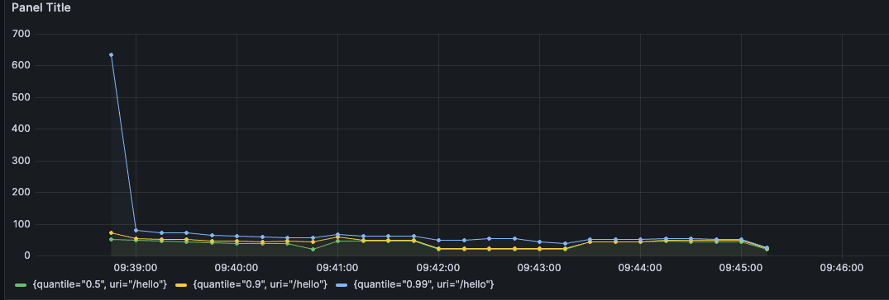 | 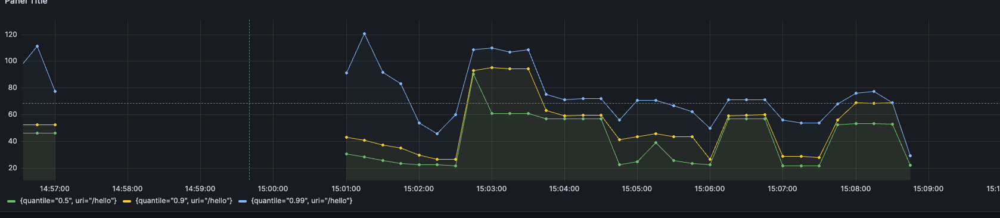 |
| CPU和内存占用情况      | 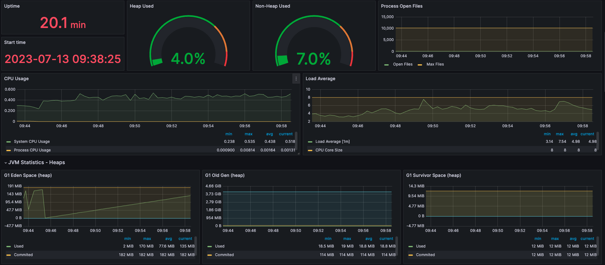 | 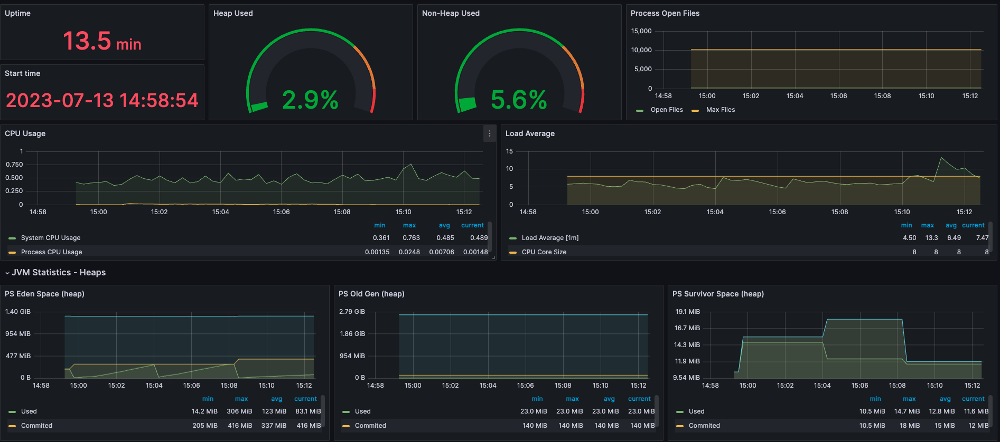 |
| Arthas耗时分析      | 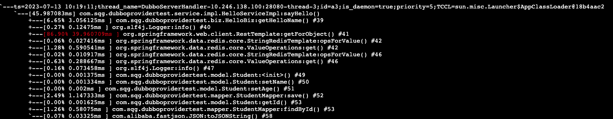 | 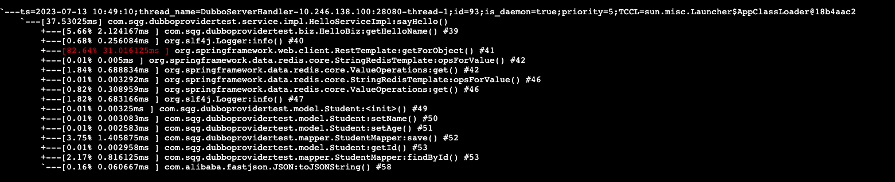 |

#### 3.2 使用apache bench测试服务响应
使用apache bench分别在20、50、100、200并发下对请求耗时的影响,发送2000个请求 http://localhost:8081/hello?name=123

| 列项                 | 使用one-logger                        | 不使用                                 |
|--------------------|-------------------------------------|-------------------------------------|
| 2000requests 20并发  | 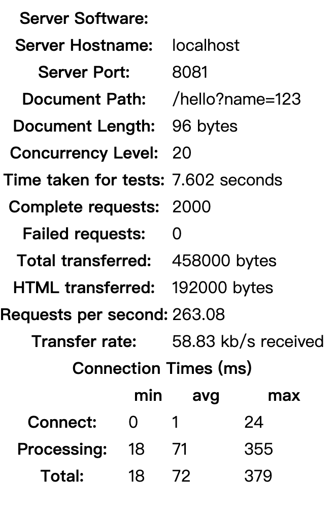 | 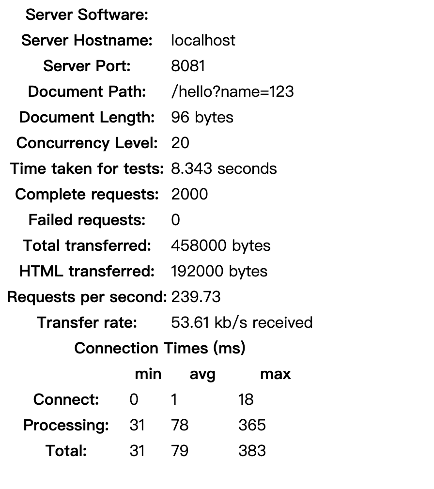 |
| 2000requests 50并发  | 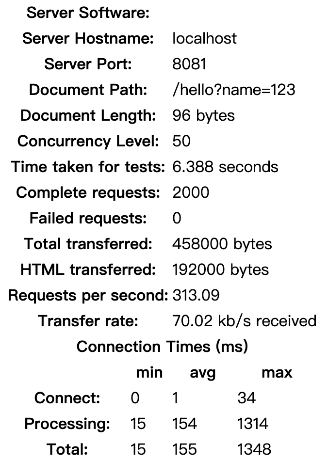 | 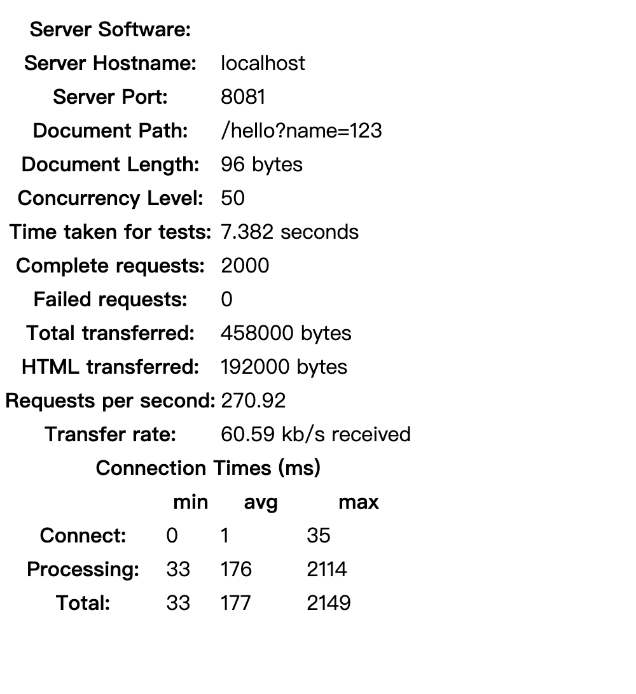 |
| 2000requests 100并发 | 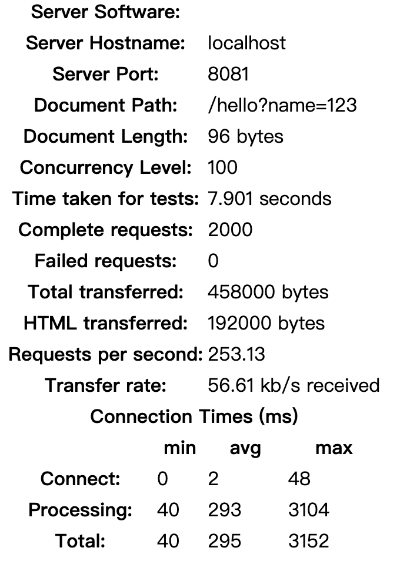 | 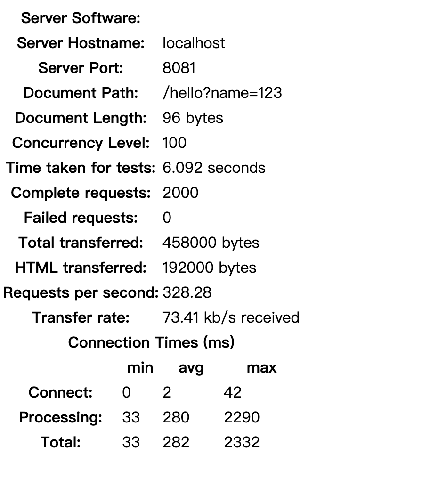 |
| 2000requests 200并发 | 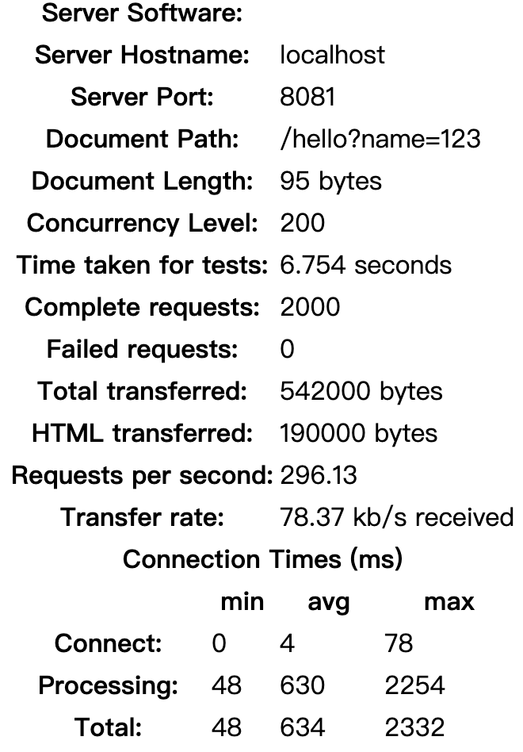 | 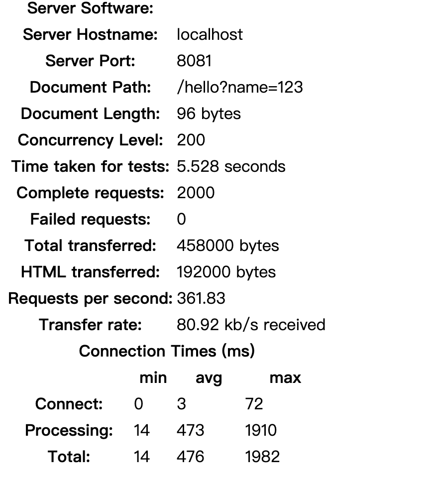 |